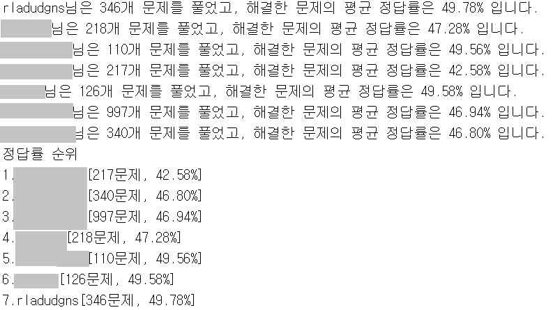

# BOJ-analysis-tool
백준 유저가 해결한 문제들의 평균 정답율을 계산해준다.

### 사용법
- main.py : 분석하고자 하는 사용자 아이디를 넣는다.

### 이외 함수설명
- crawling.py : beautifulsoup을 이용하여 백준의 문제번호와 정답율을 list로 반환
- database.py : sqlite connect, insert, select 기능
- percentage.db : 백준의 문제번호와 정답율이 저장된 Database
- save_at_db.py : 백준의 문제번호와 정답율을 DB에 저장해주는 실행문
(crawling.py, save_at_db는 백준 사이트의 트래픽 부하를 줄 수 있음)

### reference
BOJ : https://www.acmicpc.net/
